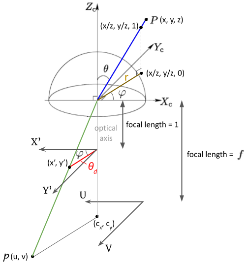

# OpenCV Fisheye Model

It originated from [the Kannala-Brandt camera model](https://ieeexplore.ieee.org/document/1642666) and is suitable to describe the projections of different types of lenses, including the perspective projection of a pinhole camera and various projections of fisheye lenses.

Considering the projection from a 3D point $P(x, y, z)$ to a image plane, polar angle $\theta$ and azimuthal angle $\varphi$ are computed:

$$ a = {x \over z};\ b = {y \over z};\ r^2=a^2+b^2 $$ 
$$ => \  \theta = arctan(r/1); \ \ \varphi=arctan(b/a)$$

The radially symmetric distortion of fisheye lenses is incorporated in the following conversion:
$$ \theta_{d} = \theta(1+k_1\theta^2+k_2\theta^4+k_3\theta^6+k_4\theta^8) $$
3D points are distortedly projected onto the normalized image coordinates(focal length = 1). Please notice $\theta_d$ represents the length from the optical axis to the projected point on the normalized image coordinates. It is more like a radius rather than an angle. Two components x' and y' are computed as:
$$ x' = \theta_{d}cos\varphi = \theta_{d}({a \over r});\ y' = \theta_{d}sin\varphi=\theta_{d}({b \over r})$$
Finally, the coordinates of the image plane, $p(u,v)$, is obtained by perspective projection:
$$ u = f_x  (x' + \alpha y');\ v=f_yy' + c_y $$

  

# References
- [OpenCV Fisheye Camera Model](https://docs.opencv.org/3.4/db/d58/group__calib3d__fisheye.html)
- [A generic camera model and calibration method for conventional, wide-angle, and fish-eye lenses](https://ieeexplore.ieee.org/document/1642666)
- [Normalized camera matrix and normalized image coordinates](https://en.wikipedia.org/wiki/Camera_matrix#Normalized_camera_matrix_and_normalized_image_coordinates)
